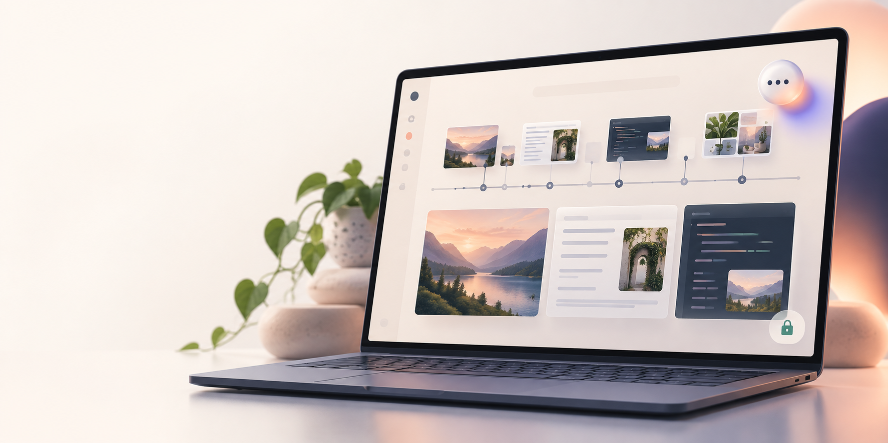
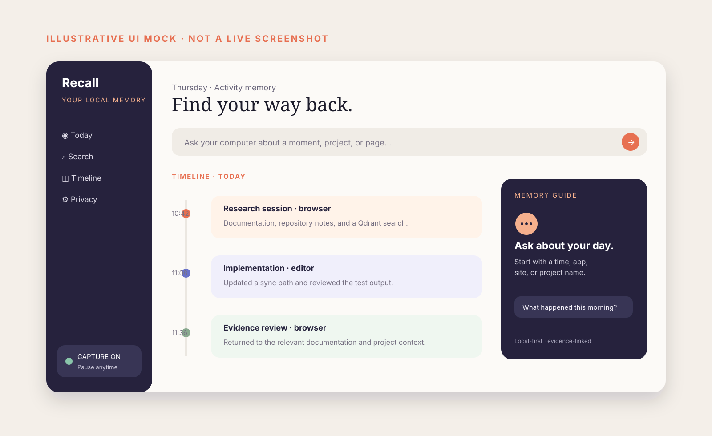
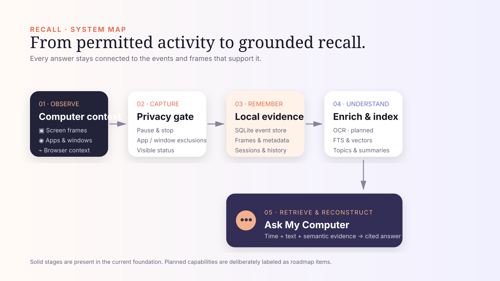
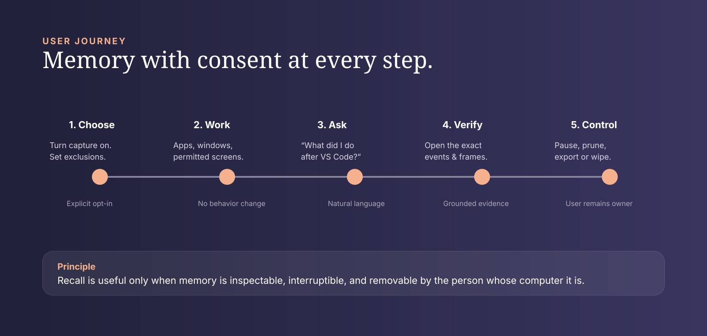
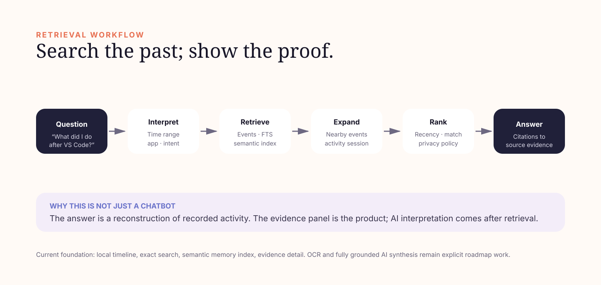

# Recall

> **A local-first memory layer for your personal computer.**
> Recall turns permitted computer context into an inspectable timeline, so you
> can find what happened, where you saw it, and what you were working on.



[See the product site](https://marketing-cyan-iota.vercel.app) · [Run the Windows preview](docs/windows-desktop.md) · [Explore the visual kit](public/showcase)

Recall is an independent open-source research and product project. It is not a
Microsoft product and is not affiliated with, endorsed by, or built from
Microsoft Recall. The direction is informed by the broader move toward
computers with memory, context, and agentic capabilities, and by products and
projects such as Windows Recall, Dayflow, Screenpipe, and ActivityWatch.

## The pitch

Today's computers execute commands. Recall is being built so a computer can
remember the *context behind them* — the permitted apps, windows, visual
evidence, and activity sequences that made up a moment of work.

This is not a screenshot recorder, time tracker, or generic chatbot. It is a
memory system built around **events + evidence + time**. The intended outcome
is simple: ask, “What was I doing yesterday afternoon?” and receive a
reconstruction that points back to the actual recorded evidence.

```text
Computer → Observe → Remember → Understand → Retrieve → Reason → Assist → Act
```

The first useful product is the memory layer. Assistance and carefully
permissioned action come later, once recall is reliable.

## What it looks like

This mock illustrates the intended workspace interaction; it is a design
reference, not a claim that every surface is already shipped.



## System architecture

Recall keeps raw local evidence separate from derived semantic memory. That
distinction is what makes an answer auditable: a vector match may help find a
moment, but it must never replace the underlying event or frame.



### The memory model

| Layer | What it holds | Why it matters |
| --- | --- | --- |
| Evidence events | timestamps, app, process, window title, source metadata | establishes what happened and when |
| Visual frames | permitted capture, hash, window context, future OCR | reconnects memory to what was seen |
| Sessions | related sequences of activity and source IDs | reconstructs work instead of listing isolated rows |
| Semantic memory | derived summaries, embeddings, topics, version metadata | makes meaning-based retrieval possible |
| Retrieval pack | ranked evidence, temporal neighbors, citations | gives AI a bounded, grounded context |

The local SQLite evidence store remains the source of truth for events and
frames. Qdrant is a derived semantic index for memories, not the only record
of the user’s history.

## User journey

Memory has to be voluntary and controllable. Capture is not the first step in
a funnel; it is an explicit decision the user can reverse.



## How “Ask My Computer” should work

A memory answer is a retrieval and reconstruction problem before it is a
language-model problem. The desired workflow combines time, exact text,
semantic similarity, and nearby activity — then makes the sources available to
the person asking.



Example questions the product is designed to answer:

- “What was I doing yesterday afternoon?”
- “Where did I see that Qdrant documentation?”
- “What did I do after opening VS Code?”
- “Reconstruct everything I did for this project today.”

## What is real today

The project has a working Windows-oriented foundation, not a finished
all-seeing personal agent.

| Available in the current foundation | Deliberately not claimed as complete |
| --- | --- |
| opt-in foreground application and window-title capture on Windows | OCR and rich visual understanding |
| explicitly confirmed primary-monitor screenshots, change detection, local frame storage and app/window exclusions | browser URL/tab permission flow, clipboard, file activity, input/AFK, and audio |
| normalized local SQLite evidence ledger, FTS5 frame support, retention pruning, and a confirmed full local wipe | full hybrid retrieval and grounded AI-generated answers |
| local Qdrant semantic memory index, offline search, version history, privacy-gated optional cloud-sync outbox, and a portable native Windows desktop shell | full settings, export, per-range deletion UX, and a code-signed installer |
| local API, dashboard, selected-session evidence inspector, and deterministic session reconstruction | cross-platform capture adapters |

The roadmap diagrams deliberately mark planned capabilities rather than
presenting them as complete.

## Privacy is the product

Computer memory is exceptionally sensitive. Recall defaults toward local
control and makes capture visible:

- explicit opt-in for visual capture (`confirm_visual_capture: true`);
- recording status, pause, stop/kill control, and app/window exclusions;
- local storage by default, with optional cloud sync restricted to deliberately
  eligible *derived* memories;
- local retention pruning and confirmed full evidence wipe;
- evidence links so a future summary can be inspected, removed, or corrected.

The current foreground collector records the active app and window title. The
visual runtime captures the primary display only after confirmation. It does
not capture keystrokes, clipboard contents, browser URLs, inactive tabs, or
raw activity for cloud upload.

## Windows preview

Recall currently targets Windows 10/11 as the first capture runtime. A
portable native `Recall.exe` build is available for demos; it is not yet a
code-signed installer.

```powershell
powershell -ExecutionPolicy Bypass -File scripts/build_windows_app.ps1
```

For the portable-app workflow and requirements, see
[Recall for Windows](docs/windows-desktop.md). For development:

```powershell
python -m pip install -e .
cd frontend
npm install
npm run dev
```

Run the non-destructive demo readiness check before a presentation:

```powershell
python scripts/demo_preflight.py --dashboard-url http://127.0.0.1:3001
```

It checks the dashboard and local evidence APIs without seeding data, starting
capture, changing network state, or deleting data.

## Build plan

```text
NOW      Windows opt-in capture → local evidence → sessions → timeline/search
NEXT     OCR + browser/file adapters → hybrid retrieval → cited Ask My Computer
THEN     exports + per-range deletion → desktop packaging → platform adapters
LATER    carefully permissioned assistance built on reliable memory
```

The engineering priority is durable local memory architecture, not a polished
chat demo detached from evidence.

## Project references

- [Architecture notes](docs/architecture.md)
- [Capture behavior](docs/capture.md)
- [Memory format](docs/memory-format.md)
- [Timeline and session design](docs/timeline.md) and [session rules](docs/session.md)
- [Sprint and demo planning](docs/recall-sprint/00-README.md)
- [Third-party notices](THIRD_PARTY_NOTICES.md)
- [Showcase asset provenance](public/showcase/README.md)

Some historical documentation describes the predecessor/OpenChronicle-era
architecture. It is useful design context, but the “What is real today” table
above is the authoritative product-status statement for this repository.

## License

Recall is distributed under the [MIT License](LICENSE).
